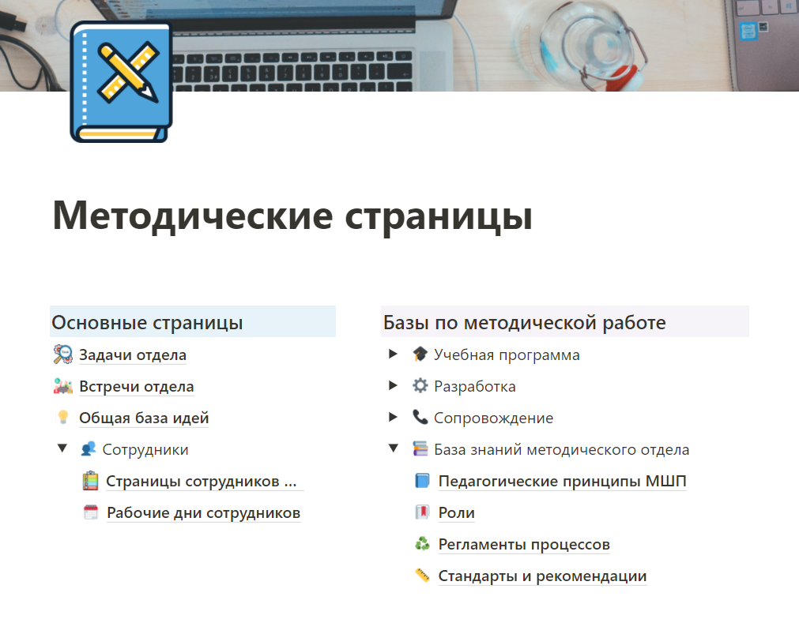
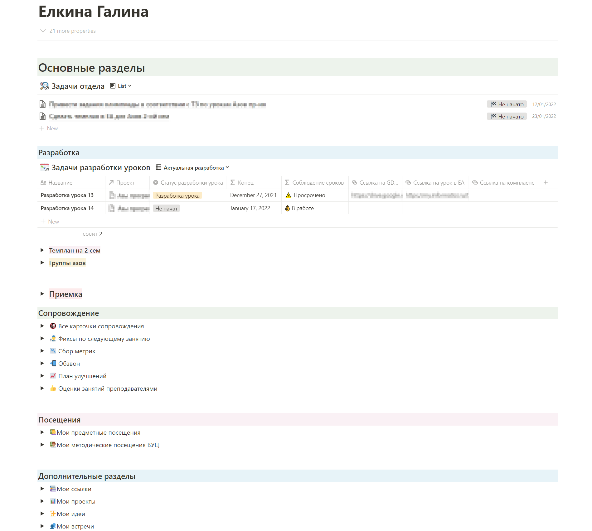

# Инвариантное задание 1.4

*Провести анализ информационного ресурса заданного назначения, созданного или используемого структурным подразделением.*

**Форма отчета:** Анализ (текстовый документ)

---

Для организации и ведения работы методический отдел МШП использует сервис Notion.

В нем есть главная страница всего отдела, которая выглядит так:

Здесь есть некоторое разделение на "Основные страницы" и "Базы по методической работе".

Первый раздел содержит в себе различные страницы, с которыми работают сотрудники каждый день, чтобы организовать свой рабочий день или отметить выполненную работу.  
Второй раздел содержит в себе исключительно базы данных, которые сотрудники видят чаще в урезанном формате.

Но также у каждого сотрудника есть своя собственная страница, где он ведет свою работу и по которой отчитывается своему руководителю. Эта страница у каждого сотрудника выглядит по разному. Моя страница выглядит следующим образом:

Так как на данной странице находится очень много конфиденциальной информации, она скрыта в раскрывающихся списках. Но общая концепция страниц такая: каждый сотрудник имеет несколько основных разделов, с которыми работает каждый день, а также несколько дополнительных, которые открываются по мере надобности. 

Доступ на каждую из страниц предоставляется инфивидуально каждому сотруднику руководителями отдела. Также у данного сервиса есть мобильное приложение, которое позволяет сотрудникам выполнять свою работу даже тогда, когда под рукой нет ноутбука - это полезно, когда сотрудника методоческого отдела посещает гениальная мысль для разработки урока.